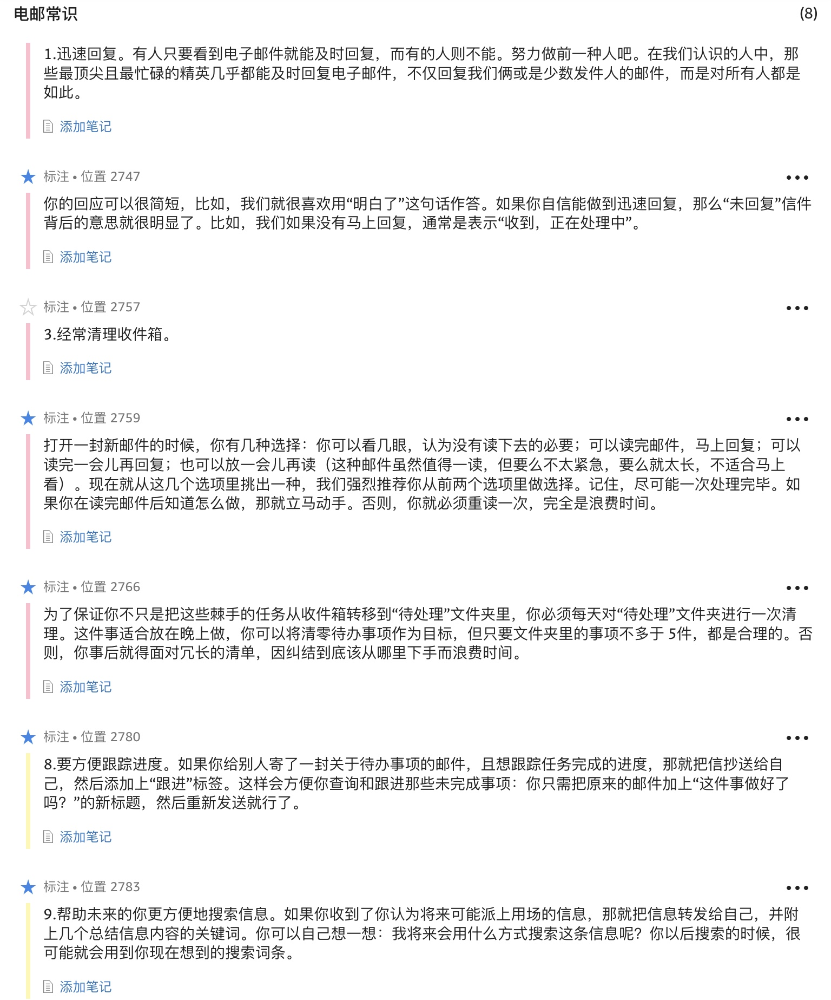
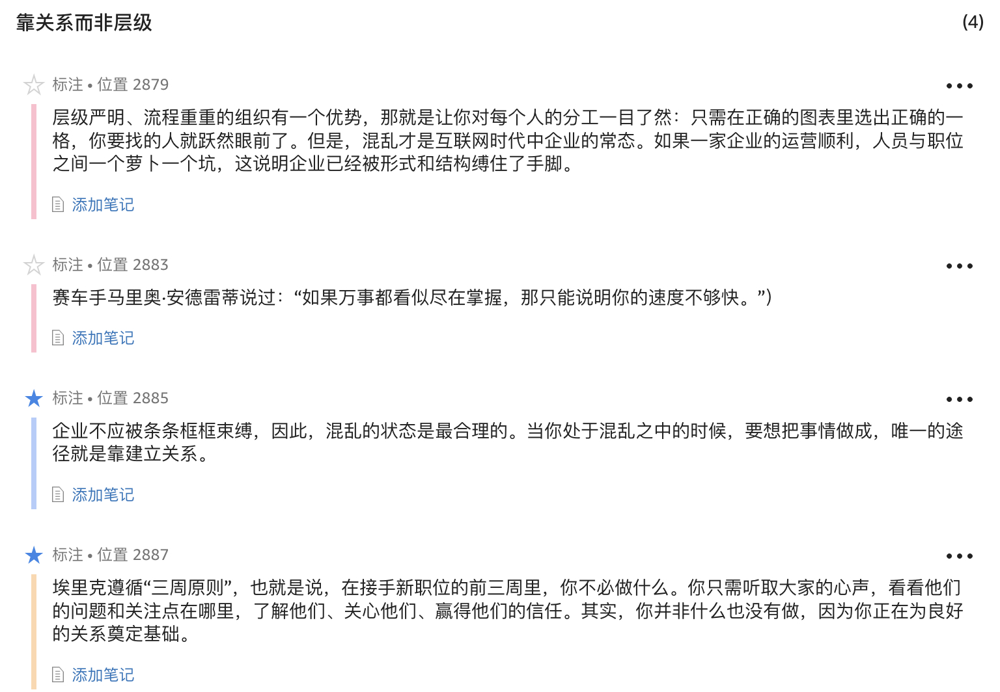
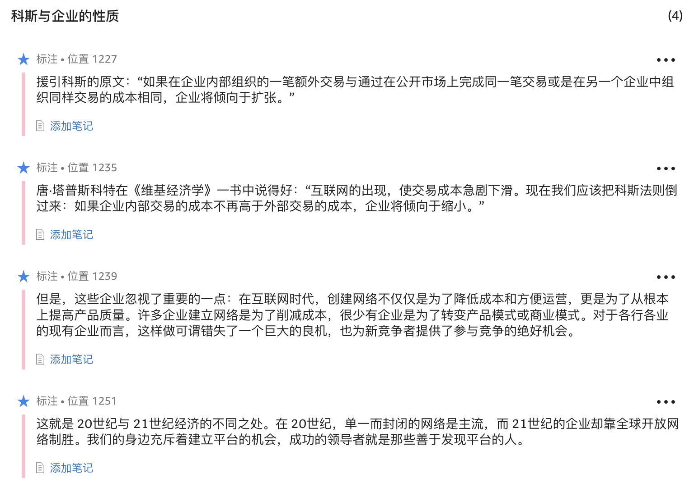

1. **用经济术语来说，如果某行业产品主要要素的成本曲线下降，那么该行业必将会出现剧变。**
1. 许多人认为，正常上班时间在家办公代表了一种进步文化的"高境界"。但正如乔纳森常说的，在家办公其实无异于一种会在整个公司内蔓延、让员工士气萎靡不振的瘟疫。
1. 在面对企业内部的团队时也应抱有这种态度：那些无论你是否批准都按自己的想法做事的人，才值得你投资。你会发现，这样的人往往会成为企业最为宝贵的创意精英。
1. 在管理层的顶端，最有影响力的人（也就是执掌企业运营大权的人）应该是产品负责人。在首席执行官召开的会议上，至少有一半与会者应是产品与服务方面的专家，负责产品研发。这样可以确保领导层将注意力放在卓越的产品质量上。
1. 一款产品的设计绝不应该带有企业组织结构的痕迹。
1. **自负会让人产生盲点，因此非常危险。**
1. **信赖技术洞见，而非市场调查......这所谓的技术洞见，是指用创新方式应用科技或设计，以达到生产成本的显著降低或产品功能和可用性的大幅提升。依靠技术洞见生产出来的产品，可以与同类竞争产品拉开显著差距。而这样一来，产品不仅得到了显著的提升，且无须大肆宣传也照样能让消费者感受到其独一无二的魅力。**
1. **与满足消费者的现有需求相比，满足消费者尚未意识到的需求更为重要。**
1. **当我们的环境中充斥着丰富多样的素材，可供我们通过组合和再组合进行新的创作时，就表示组合创新时代来临了......当今，这些要素指的是信息、连接以及计算能力。世界上所有的信息、近乎无限强大的计算能力、通达全球的技术，都为未来的发明者们所用。**
1. **新科技往往是为了解决非常具体的问题而问世的，且在刚刚出现时都非常粗糙。**
1. **以技术洞见来支撑产品研发，你就能够避免被消费者的需求牵着鼻子走，生产出步人后尘的产品。**
1. **商业生态系统至关重要。互联网时代最成功的领导者，是那些懂得如何创造平台并快速发展平台的人。所谓平台，从本质上来说就是一套能够吸引供应商及用户群，从而形成多边市场的产品或服务。**(Jessi Hempel, "How Facebook Is Taking Over Our Lives")
1. 平台还有一个重要的优势：随着平台的不断扩张和不断升值，越来越多的投资会涌进来，有助于平台支持的产品与服务的升级。因此我们说，科技行业中的企业永远"只看平台，不看产品"。
1. 如果你把注意力放在竞争对手身上，那你绝不会实现真正的创新。当你与竞争对手为了市场占有率的几个百分点争得不可开交时，半路往往会杀出一个不在乎市场占有率的竞争者，用全新的平台颠覆整个游戏。
1. 当某一市场遭到破坏时，会出现两种情形。如果你已在这个市场中站稳脚跟，你可以并购或创建一个破坏性挑战者，也可以采取无视的态度。无视挑战者的做法只会在短期内有效，**如果你选择的是并购或创建，你必须对挑战者的技术洞见和进攻套路了如指掌......如果你是挑战者，你需要发明出新产品，并围绕产品打造你的企业，还需清楚既有企业用来遏制你的工具（比如业务关系、商业规范和法律诉讼）以及为你设置的障碍。**
1. 在商场上，尤其是在高科技领域内，仅仅有高超的技能是不够的，你至少必须抓住一轮大浪，借力一路到达彼岸。应届毕业生最看重的往往是公司，然后才考虑职位和行业。但是，在职业生涯的起点，这样的排序恰恰是本末倒置。在职业生涯中，许多人往往会换好几次公司，而改变行业却要困难得多，因此，选择好行业才是重中之重。把行业视为你冲浪的地点，把公司当成你赶上的海浪。选择海浪最大最棒的地点，才是你明智的决策。
1. **经济学家哈尔·范里安认为，哪些产品的价格越来越低廉，人们就应该培养与这些产品相配套的领域所需的专业知识和技能。**
1. 请注意，"共识"这个词并没有"一致同意"的意思，也就是说，"共识"并不是指人人都必须同意，而是指共同达成对公司最有利的决策，并围绕决策共同努力。
1. 最好的决策应该是正确的决策，而不是竭力争取大家一致同意而找出的最低标准，也未必是领导人自己的决策。
1. 如果你的产品只是满足了消费者提出的需求，那么你就不是创新，而只是做出回应。
1. **创新的东西不仅要新颖、出人意料，还要非常实用。**
1. 在决定是否要实践某个想法的时候，Google[x]团队会用到一张简单的维恩图[2]。第一，这个想法必须涉及一个能够影响数亿人甚至几十亿人的巨大挑战或机遇。第二，这个想法必须提供一种与市场上现存的解决方案截然不同的方法。我们不希望在已有的做事方法上做改进，而是想**另辟蹊径**。第三，将突破性解决方案变为现实的科技至少必须具备可行性，且在不久的将来可以实现。
1. 不要把眼光放在无人问津的市场并在这里孤军奋战。你应当发掘创新的途径，跻身进入大型或有潜力发展壮大的市场上。这个理念看起来或许难以接受，毕竟，未被开发且无人竞争的崭新市场，许多实业家都想进入。但是，一个市场通常不会平白无故就乏人问津，而是因为市场规模无法支撑其事业的扩张。
1. 有创意的人不需要别人来布置任务，而需要有人提供空间。
1. 创新的混沌环境需要给这些创新人才 — 或者说在山边独舞的疯子 — 创造条件。但除此之外，这个环境还需要给那些参与创新项目的人 — 也就是从第二个到第二百个加入群舞的疯子 — 创造空间。
1. 如果你要造一款省1/10汽油的车，只需对现行设计做些改动；但如果你想造一款每加仑油可以跑500英里的汽车，那就得从头开始了。**仅仅通过思考"我该如何从头开始？"这个问题，就可以刺激你萌生从未有过的想法。**
1. 除此之外，往大处想还有其他微妙的好处。赌注下得越大，成功的概率往往也越大，因为企业无法负担失败的损失。另一方面，如果你下了一连串较小的赌注，没有一个能威胁到企业的安危，那么你便有可能以平庸告终。
1. 需要注意的是，我们只有在产品展现出胜者锋芒之后才会投入资源。
1. 要计划在上市后的适当时机为产品添加一款让人眼前一亮的功能。这样的做法可以让用户习惯于先接受功能有所局限但质量过硬的新品，然后再等着功能快速得到扩充的模式。
1. 要想创新，就要学会把败仗打漂亮，学会从失误中汲取教训。所有失败的项目都会衍生有关技术、用户以及营销方面的宝贵信息，为你的下一次出征做准备。
1. **修改创意，而不要否决创意。**世界上多数伟大发明的最终用途与最初设想都是天差地别。因此在放弃一个项目时，要仔细审视其组成部分，看看有无可能重新投放在其他领域。
1. **管理者的任务不是规避风险或防止失败，而是打造一个不会因风险和无可避免的失误而垮台的环境。**
1. 我们曾经认为，互联网以及其他通信技术的出现会导致更多商业中心的崛起，并撼动既有商业中心的地位。但事实证明，情况正好相反。各个行业中的确出现了新的小规模商业集群，但既有商业集群的地位却不降反升。
1. **我们觉得，几乎所有大的难题都可以归结为信息问题，也就是说，只要有足够的数据、具备足够的数据处理能力，人类所面临的几乎所有问题都有解决方法。**