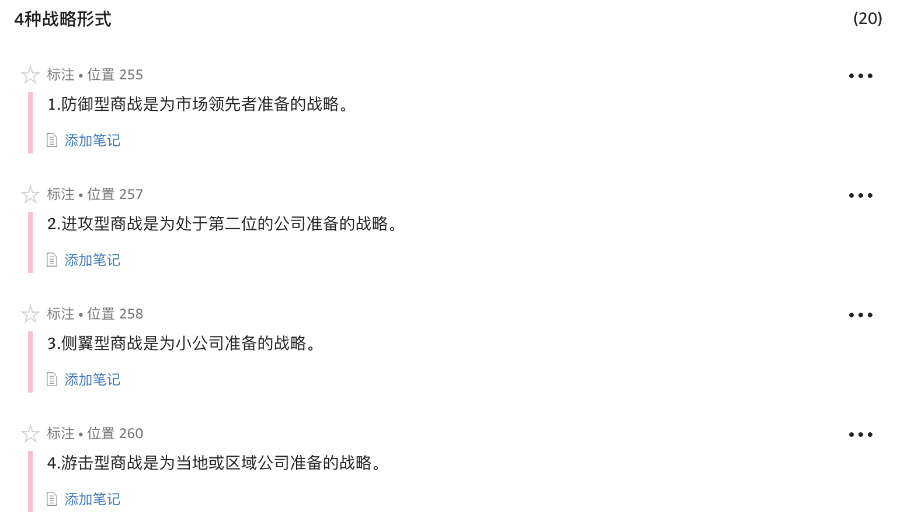
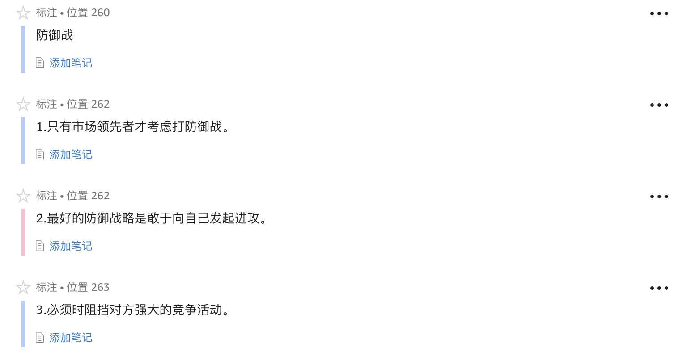
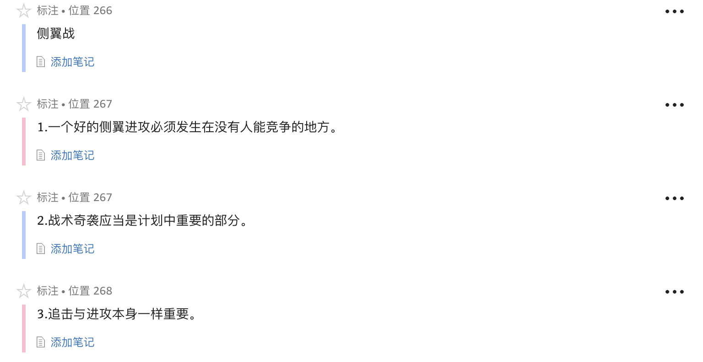
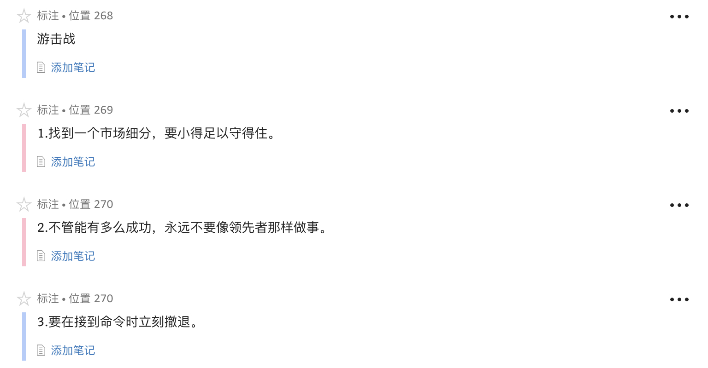

1. 如果十几家公司都在努力满足同样一批顾客的需求，那么只了解顾客的需求已无多大用处。美国汽车公司的问题并不在于有多少顾客，而在于如何与通用、福特、克莱斯勒以及其他进口汽车进行竞争。
1. 今天，一个公司要想成功，必须要面向竞争对手。它必须寻找对手的弱点并针对那些弱点发动营销攻势。
1. **赢家和输家的差别很少在于雇员，而几乎总是由于策略。**
1. 思维正常的军事指挥官绝不会给胜利制定一个时间表。
1. **营销的承诺应该像政治用语一样模棱两可，否则这些承诺会削弱你的力量。**
1. 但是，单纯的进攻并不是优秀军事战略的标志，尤其是那种管理层以“更多”为口号的情况……**假如一心只想靠努力来获胜，通常都是以失败告终。**从第一次世界大战的战壕到第二次世界大战中斯大林格勒的街道，让士兵陷入肉搏战的军事指挥官们大都失败了。
1. **不管什么时候，如果你听到上司说“我们得加倍努力了”，你就知道你听到的是失败的言论。**
1. 营销在10多厘米宽的战场上展开，它就是客户的头脑。在了解营销本质的过程中，这是个关键概念。你获胜不是因为你有一个好产品，而是因为你的感悟力更强。
1. 你所应该做的是探察其他公司的形势，要找出是哪家公司在占据客户心智的制高点。
1. 占领者的本能通常都是错误的。贪欲常唆使一个品牌领先者增加兵力，以期控制整个阵地。而结果常常是，在试图保住阵地的某一小部分时，整个阵地丧失殆尽。
1. **“简单容易”的想法常诱使人们掠夺弱者而不是强者，但是事实正好相反，公司规模越小，就越努力保卫自己拥有的份额，还会采取以下战术，如降价、打折、延长保修期。因此，绝不要同一头受伤的野兽较量。**
1. 对于美国汽车公司而言，它也太小，不能向汽车行业发起侧翼战。**并非是它太小而不能发起侧翼战，正如纳什·兰布勒（Nash Rambler）所证实的那样，而是因为它在进攻后难以控制自己首先倡导的概念。对美国汽车公司来说，唯一常胜不败的法宝就是它的吉普车。这是一个经典的游击战术，要找到一个足以赢利但又不能引起市场领先者兴趣的细分市场。**
1. 那些看到战争是无法避免的而犹豫不决不主动进攻的政治家是犯有叛国罪的。

1. 单靠模仿领先者是无法成功的，然而很多公司总是执迷不悟，他们总是先找出IBM怎么做，然后加以模仿。要想获胜，只有把领先者的策略完全推翻。要么找出领先者优势中的弱点，要么进行侧翼进攻，要么打游击战，要么集中自己的兵力。
1. 战略要靠对战术的详尽了解发展而来，而矛盾的是优秀的战略往往并不依赖最好的战术来实现。优秀稳妥的战略的精髓是能够不依赖出色的战术而在商战中取胜。
1. 倘若一个公司士气极为低落，来自外部的战略根本没有获胜的指望，公司更需要领导而不是战略，这时，一个自负、以自我为中心的人可能成为最好的领导，因为这时公司最需要的是内部能够鼓舞士气的领袖。
1. 大致算来，进攻要想成功的话，应该在进攻地点至少投入敌方的3倍兵力。
1. 每家都有3种类型的产品：一种是需要做广告的产品，一种是需要销售的产品，还有一种是需要盈利的产品……多家公司最大的错误是，混淆了应该销售的产品和应该做广告的产品。只要顾客到了你的店里，你向他提供什么食品都无所谓。但是，对同样的产品做广告却是个极大的错误，这也许会削弱你的地位。
1. 在营销进攻战中，交通通常不成问题，公司可在数日内发送成千上万的产品。 瓶颈是信息的传递。让上百万的消费者知道产品信息，要花几个月甚至几年的时间。这样，防御方就有足够的时间以不同的形式阻碍破坏进攻方传递销售信息。
1. 思维正常的军事指挥官绝不会给胜利制定一个时间表。
1. 营销的承诺应该像政治用语一样模棱两可，否则这些承诺会削弱你的力量。

1. 一般来说，在每100家公司中只有1家应该打防御战，2家打进攻战，3家进行侧翼进攻，剩下的94家都应打游击战。

1. 一些营销人员实际上认为他们可以凭主观意志达到顶峰，他们信奉想象的力量。首先说服自己是领先者，然后才能让别人相信。丢掉这些思想吧。在营销策略中自以为是、自欺欺人是没有市场的。为了销售利润而夸大事实是一回事，自欺欺人而犯战略错误是另一回事。一个优秀的商业将领必须在头脑中对实际形势了如指掌，以便从事实中做出正确判断。
1. 由于防御者往往处于领先地位，防御者在顾客头脑中占有优势。提高地位的最佳途径是不断对这一优势发动进攻。换言之，你要通过介绍新产品或新服务来取代现在的产品或服务，巩固你的地位。
1. 进攻自我可能会牺牲眼前的利益，但是却有一个最大的好处，就是保卫市场份额，而这才是打赢商战的最终武器。
1. 多数公司只有一个机会获胜，而市场领先者却有两个。如果领先者失去了挑战自我的机会，还可以照搬其他公司的竞争手段。但是，领先者必须在进攻者确立地位之前迅速行动起来阻止它。
1. 记住：战争是在顾客的头脑里进行的。对于进攻者来说，要在顾客头脑里留下一个印象需要花费时间。一般情况下，这段时间对领先者来说已经足够了。
1. 付出小的代价是值得的，如果你愿意，你可以把它叫做保险费。
1. 当进攻者倾力出击时，领先者把尽可能多的钱都花在销售过程中并不合算，最好是只投入维持竞争所需的费用。
1. 如果无法获得绝对的优势，你必须灵活运用你现有的力量，在决定性的地点创造相对优势。

1. 进攻战适用于市场份额处于第二位或第三位的公司，这样的公司应有足够的力量向领先者发动持久的进攻。
1. 处于第二位或第三位的公司应该做的是把精力放到研究领先者身上。要考虑领先者的产品、领先者的销售力量、领先者的产品价格和领先者的销售渠道。
1. 当你拥有一个和领导型品牌大致相同的名字时，你就很难不成为领导者。
1. 不管第二位的公司在某一类产品上的实力多么强大，假如领先者在这方面也相当强大，前者绝没有胜算。
1. **领先者占领的是顾客的头脑。要想打赢头脑中的战斗，你必须先抢占领先者的位置，再取而代之。仅仅获胜是不够的，别人，特别是领先者，必须失败。**
1. 对于市场处在第二位的公司来说，更好的策略应该是盯住领先者，问问自己：“我怎么才能让他们的市场份额减少呢？”
1. **要在领先者“优势”中找弱点，而不是在“弱势”中找弱点。**
1. 有时，领先者会有些弱点，而那仅仅是弱点而已，并不是他们力量中固有的部分。他们只是忽略了那一点，或认为它不重要，或把它忘掉了。
1. 优秀的将军要想获胜，必须避免完全依赖人员的质量。优秀的将军要在决定性的地点拥有相对优势。

1. 发动侧翼进攻，并不需要生产出不同于市场上任何已有产品的新产品，但是你的产品中必须有创新或独特的部分，要让顾客对你的产品有新的认识。
1. 传统的市场营销理论把这种方法叫做“市场细分”，即寻找市场空缺，这是一种非常重要的能力。要想发动一次真正的侧翼战，你必须第一个抢占细分市场，否则就变成了向严密防守的敌人发动的单纯的进攻战。
1. 潜在的消费者无法知道如果将来他们的选择面有了巨大变化之后，可能会买什么商品。因此，侧翼进攻要想成功，就得极力影响消费者的选择面。
1. **领先者对未来的设想都是很公开的，假如他们公开反对某一产品发展，你就可以拥有额外的时间了。在他们仿效你之前，进行自我消化，而那就需要时间。**
1. 事实上，市场地位越强或者市场份额越多，创建替代产品的机会就越大。

1. 要试着找到一个细分市场，小得足以让你成为领先者。
1. 在越南战争中，假如我们能说服越南共产党把他们的军官派到西点军校学习一下我们的作战方法，我们就能在越南战争中获胜。
1. 游击公司应该利用大公司的这一弱点，在最前线上投入尽可能多的人员，还应该抵制住人满为患的组织方式的诱惑，不去制定流于形式的组织系统、工作说明、职位升降系统和其他一些配备。游击公司应该尽量做到把全部人员投入前线，不留任何非战斗人员。
