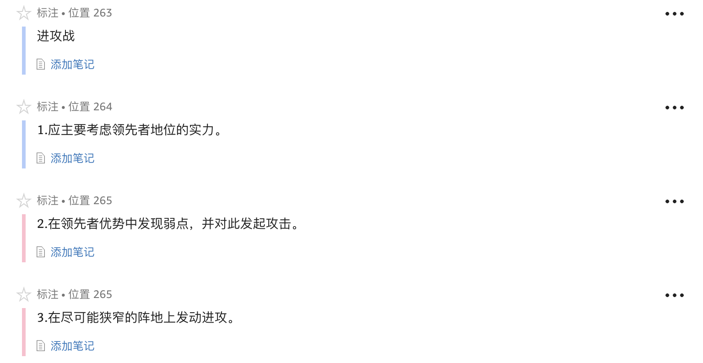

1. 如果十几家公司都在努力满足同样一批顾客的需求，那么只了解顾客的需求已无多大用处。美国汽车公司的问题并不在于有多少顾客，而在于如何与通用、福特、克莱斯勒以及其他进口汽车进行竞争。
1. 今天，一个公司要想成功，必须要面向竞争对手。它必须寻找对手的弱点并针对那些弱点发动营销攻势。
1. **赢家和输家的差别很少在于雇员，而几乎总是由于策略。**
1. 大致算来，进攻要想成功的话，应该在进攻地点至少投入敌方的3倍兵力。

1. 思维正常的军事指挥官绝不会给胜利制定一个时间表。
1. **营销的承诺应该像政治用语一样模棱两可，否则这些承诺会削弱你的力量。**
1. 但是，单纯的进攻并不是优秀军事战略的标志，尤其是那种管理层以“更多”为口号的情况……**假如一心只想靠努力来获胜，通常都是以失败告终。**从第一次世界大战的战壕到第二次世界大战中斯大林格勒的街道，让士兵陷入肉搏战的军事指挥官们大都失败了。
1. **不管什么时候，如果你听到上司说“我们得加倍努力了”，你就知道你听到的是失败的言论。**
1. 营销在10多厘米宽的战场上展开，它就是客户的头脑。在了解营销本质的过程中，这是个关键概念。你获胜不是因为你有一个好产品，而是因为你的感悟力更强。
1. 你所应该做的是探察其他公司的形势，要找出是哪家公司在占据客户心智的制高点。
1. 占领者的本能通常都是错误的。贪欲常唆使一个品牌领先者增加兵力，以期控制整个阵地。而结果常常是，在试图保住阵地的某一小部分时，整个阵地丧失殆尽。
1. **“简单容易”的想法常诱使人们掠夺弱者而不是强者，但是事实正好相反，公司规模越小，就越努力保卫自己拥有的份额，还会采取以下战术，如降价、打折、延长保修期。因此，绝不要同一头受伤的野兽较量。**
1. 对于美国汽车公司而言，它也太小，不能向汽车行业发起侧翼战。**并非是它太小而不能发起侧翼战，正如纳什·兰布勒（Nash Rambler）所证实的那样，而是因为它在进攻后难以控制自己首先倡导的概念。对美国汽车公司来说，唯一常胜不败的法宝就是它的吉普车。这是一个经典的游击战术，要找到一个足以赢利但又不能引起市场领先者兴趣的细分市场。**
1. 那些看到战争是无法避免的而犹豫不决不主动进攻的政治家是犯有叛国罪的。
1. 每家都有3种类型的产品：一种是需要做广告的产品，一种是需要销售的产品，还有一种是需要盈利的产品……**多家公司最大的错误是，混淆了应该销售的产品和应该做广告的产品。**只要顾客到了你的店里，你向他提供什么食品都无所谓。但是，对同样的产品做广告却是个极大的错误，这也许会削弱你的地位。

---

1. 一般来说，在每100家公司中只有1家应该打防御战，2家打进攻战，3家进行侧翼进攻，剩下的94家都应打游击战。

1. 一些营销人员实际上认为他们可以凭主观意志达到顶峰，他们信奉想象的力量。首先说服自己是领先者，然后才能让别人相信。丢掉这些思想吧。在营销策略中自以为是、自欺欺人是没有市场的。为了销售利润而夸大事实是一回事，自欺欺人而犯战略错误是另一回事。一个优秀的商业将领必须在头脑中对实际形势了如指掌，以便从事实中做出正确判断。
1. 由于防御者往往处于领先地位，防御者在顾客头脑中占有优势。提高地位的最佳途径是不断对这一优势发动进攻。换言之，你要通过介绍新产品或新服务来取代现在的产品或服务，巩固你的地位。
1. 进攻自我可能会牺牲眼前的利益，但是却有一个最大的好处，就是保卫市场份额，而这才是打赢商战的最终武器。反之，倘若公司在进攻自我上犹豫不决，通常就会丧失市场份额，并最终丧失市场领先者的地位。
1. 多数公司只有一个机会获胜，而市场领先者却有两个。如果领先者失去了挑战自我的机会，还可以照搬其他公司的竞争手段。但是，领先者必须在进攻者确立地位之前迅速行动起来阻止它。
1. 记住：战争是在顾客的头脑里进行的。对于进攻者来说，要在顾客头脑里留下一个印象需要花费时间。一般情况下，这段时间对领先者来说已经足够了。
1. 付出小的代价是值得的，如果你愿意，你可以把它叫做保险费。
1. 当进攻者倾力出击时，领先者把尽可能多的钱都花在销售过程中并不合算，最好是只投入维持竞争所需的费用。

1. 如果无法获得绝对的优势，你必须灵活运用你现有的力量，在决定性的地点创造相对优势。
1. 进攻战适用于市场份额处于第二位或第三位的公司，这样的公司应有足够的力量向领先者发动持久的进攻。
1. **多数公司遇到营销中的问题时，他们的第一反应是研究自身。他们开始考虑自身的力量和弱点，研究自家产品的质量、销售人员、产品价格和销售渠道。这就是为什么最后多数公司的言谈举止都好像领先者一样……处于第二位或第三位的公司应该做的是把精力放到研究领先者身上。要考虑领先者的产品、领先者的销售力量、领先者的产品价格和领先者的销售渠道。**
1. **当你拥有一个和领导型品牌大致相同的名字时，你就很难不成为领导者。**
1. **不管第二位的公司在某一类产品上的实力多么强大，假如领先者在这方面也相当强大，前者绝没有胜算。**
1. **领先者占领的是顾客的头脑。要想打赢头脑中的战斗，你必须先抢占领先者的位置，再取而代之。仅仅获胜是不够的，别人，特别是领先者，必须失败。**
1. 让敌人把应急口粮吃掉是进攻的主要目标。军队的士气至关重要，应该把重点放在破坏敌人的士气上。但是，要让市场处于第二位的公司做到这一点却不容易。因此，大多数的市场销售计划都要求“增加我们的市场份额”。在某一特定领域中，有六七家公司都会制定类似的计划，更别提正在入侵这一领地的新公司了。难怪典型的销售承诺很少实现。**对于市场处在第二位的公司来说，更好的策略应该是盯住领先者，问问自己：“我怎么才能让他们的市场份额减少呢？”**
1. 要记住，商战是场心理战。在这场战争中，人的头脑便是战场。一切进攻都应以此为目标。你的武器应该是语言、文字、图像和声音。
1. 要在领先者优势中找弱点，并向这一弱点发起攻击。
1. **要在领先者“优势”中找弱点，而不是在“弱势”中找弱点。**
1. 有时，领先者会有些弱点，而那仅仅是弱点而已，并不是他们力量中固有的部分。他们只是忽略了那一点，或认为它不重要，或把它忘掉了。
1. **我们建议消费者“成为领先者的对手”，即第二条攻击战原则的另一种解释：“找到领军者的软肋。”**
1. 产品。“品种齐全”是一种奢侈，只有领先者能担负得起。
1. 优秀的将军要想获胜，必须避免完全依赖人员的质量。优秀的将军要在决定性的地点拥有相对优势。
1. 问问你自己：防御者能在不削弱自己地位的条件下赶超你吗？**优势通常也是弱点，但是你得找到优势中的漏洞。**

1. 发动侧翼进攻，并不需要生产出不同于市场上任何已有产品的新产品，但是你的产品中必须有创新或独特的部分，要让顾客对你的产品有新的认识。
1. 虽然表现不太明显，侧翼进攻却常常取决于你创造和维持独特产品风格的能力。这点做起来并不容易，特别是防御者可能会否认新产品风格的存在，进而挫败你的进攻。
1. 传统的市场营销理论把这种方法叫做“市场细分”，即寻找市场空缺，这是一种非常重要的能力。要想发动一次真正的侧翼战，你必须第一个抢占细分市场，否则就变成了向严密防守的敌人发动的单纯的进攻战。
1. 发动侧翼进攻需要独特有远见的眼光。其原因在于，在一次真正的侧翼进攻中，新产品或服务项目并没有现成的市场。
1. **假如你的资源不够，无法继续维持侧翼进攻的胜利怎么办？也许你一开始就不应该发动侧翼进攻，而应该打游击战。**
1. 潜在的消费者无法知道如果将来他们的选择面有了巨大变化之后，可能会买什么商品。因此，侧翼进攻要想成功，就得极力影响消费者的选择面。
1. **领先者对未来的设想都是很公开的，假如他们公开反对某一产品发展，你就可以拥有额外的时间了。在他们仿效你之前，进行自我消化，而那就需要时间。**
1. **事实上，市场地位越强或者市场份额越多，创建替代产品的机会就越大。**

1. 在某些方面，游击战看起来像侧翼战，你会说比如劳斯莱斯就是以高价位发动的侧翼战。但是，侧翼战和游击战有根本性的区别。侧翼战是经过策划，在距离领先者较近的前线刻意发动的，其目标是夺取或削弱领先者的市场占有率。
1. 劳斯莱斯是个真正的游击公司。实际上，劳斯莱斯能从别的公司那里夺走生意，然而它的策略并非针对瓦解竞争对手的地位。劳斯莱斯经销商可以像其他汽车经销商一样，从地方债券销售或珠宝店那里把生意夺走。
1. 游击性的公司应该把眼光放在多小的市场上呢？这一点是一切判断的基础。**要试着找到一个细分市场，小得足以让你成为领先者。**
1. **在越南战争中，假如我们能说服越南共产党把他们的军官派到西点军校学习一下我们的作战方法，我们就能在越南战争中获胜。**
1. 游击公司应该利用大公司的这一弱点，在最前线上投入尽可能多的人员，还应该抵制住人满为患的组织方式的诱惑，不去制定流于形式的组织系统、工作说明、职位升降系统和其他一些配备。游击公司应该尽量做到把全部人员投入前线，不留任何非战斗人员。
1. 员工和头衔不多还有一个很大的好处。假如你是公司在拉丁美洲的执行副总裁，而你的公司试图放弃拉美市场，你会竭尽全力拼命保卫你的地盘。在大公司里，在公司有所变动之前都会产生众多内部纷争。而小公司就不必经历那些内部风波，就能很快改变计划。
1. 行业游击战成功的关键是窄而深，绝不能广而浅。进行行业游击战的公司倘若把它的系统扩展到其他行业中，它必定会面临许多麻烦。
1. 在销售系统中，高价位能创造“能见度”。消费者会说：“看，他们的产品价位怎么那么高？”他们接着会问为什么。当然，这就给商家创造了一个机会，告诉消费者他们的产品贵在哪些地方。
1. ……许多公司常常无法弄懂，一年内就算是很小的利润差异也意味着巨大的长期优势……对于增加广告预算，最高管理层总是错误地问：“投资的收益如何？”……相反，他们应该问：“我们应该投资多少以确保胜利？”**克劳塞维茨曾指出，战争中胜利和失败的界限有时就在于“战场上胜方和败方在人员伤亡、战俘、炮火损失等方面的微小差异”。**

---

1. 假如我们认为战略是独立于战术结果之外的力量，就会陷入错误之中。
1. 就像形式应该服从内容一样，战略应该服从战术的需要。
1. 战术结果的取得是战略的最终目标和唯一目的。如果一个给定战略不能为战术结果服务，不管它的战略构思多么巧妙，表达得多么动人，这个战略也是错误的。
1. **战略应该来自底层，而不是顶层。**
1. **优秀稳妥的战略的精髓是能够不依赖出色的战术而在商战中取胜。**
1. 如果你擅长表演，那么你既能成为称职的领导，也能成为优秀的战略家。