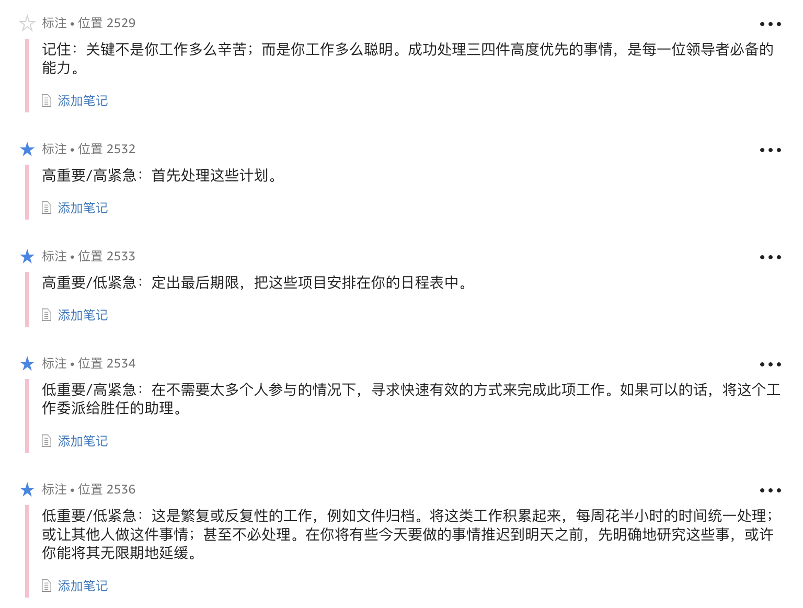
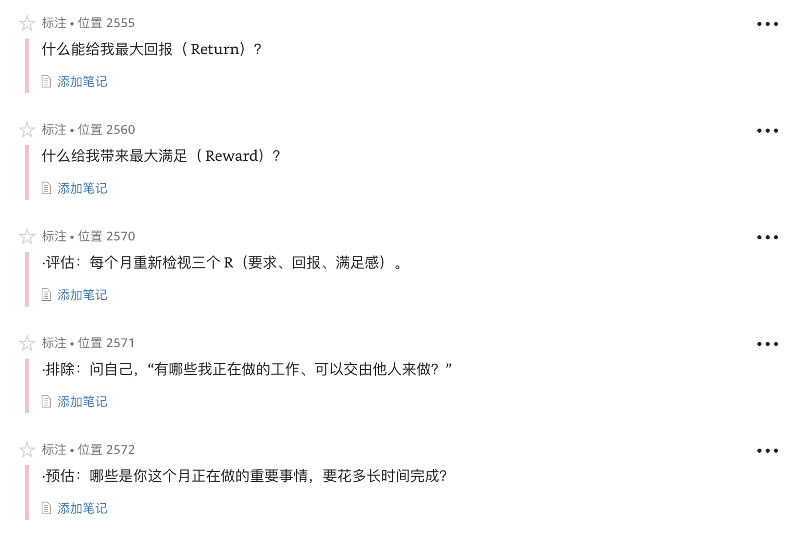

1. 好是最好的敌人
1. 如果你的工作过量，先将你的优先次序列在一张纸上，然后再拿到老板面前，看看他会选择哪些为优先事项。
1. 罗伯特·麦肯（Roben J.McKain）曾说：**"大部分主要目标无法达成的原因，是因为我们将时间用在第二优先的事情。"**
1. 如果一个领导者没有杠杆，即影响力，他就毫无成效可言。
1. 哈瑞·奥华史狄里特（Harry A.Overstreet）说："所有影响力最根本的本质，是在于让他人参与。"
1. 