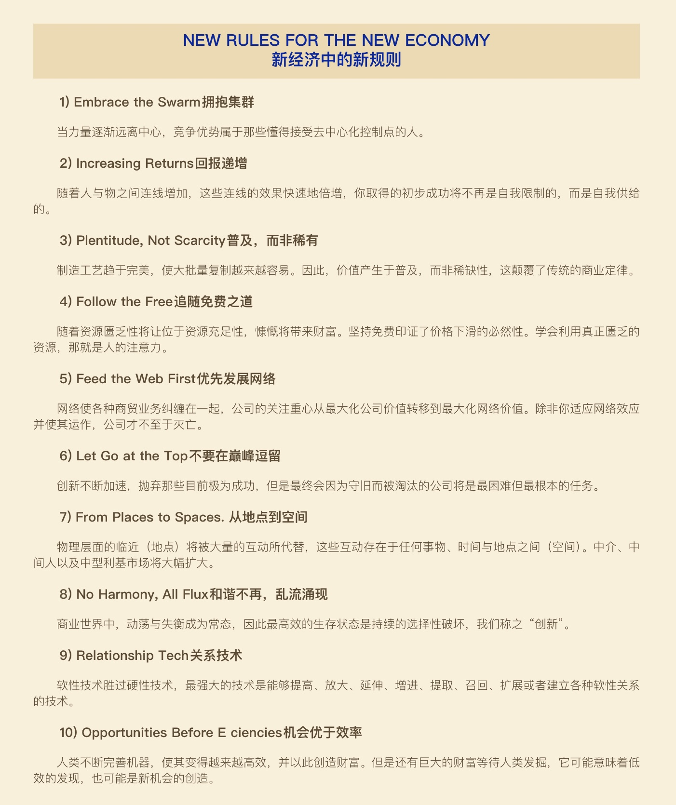
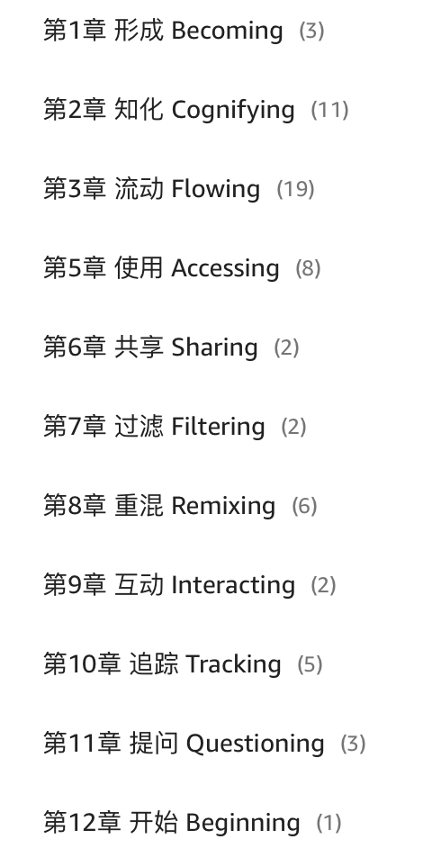
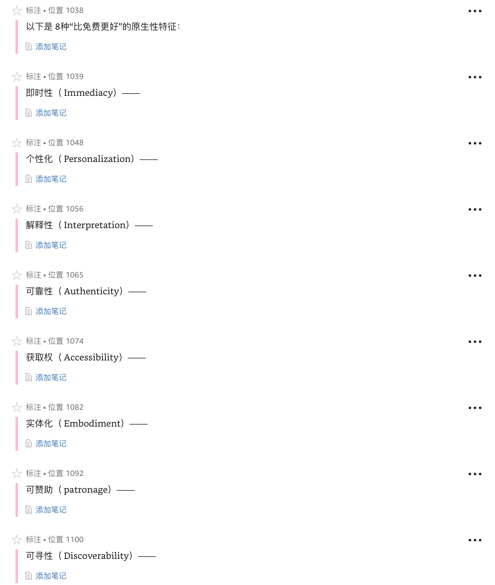
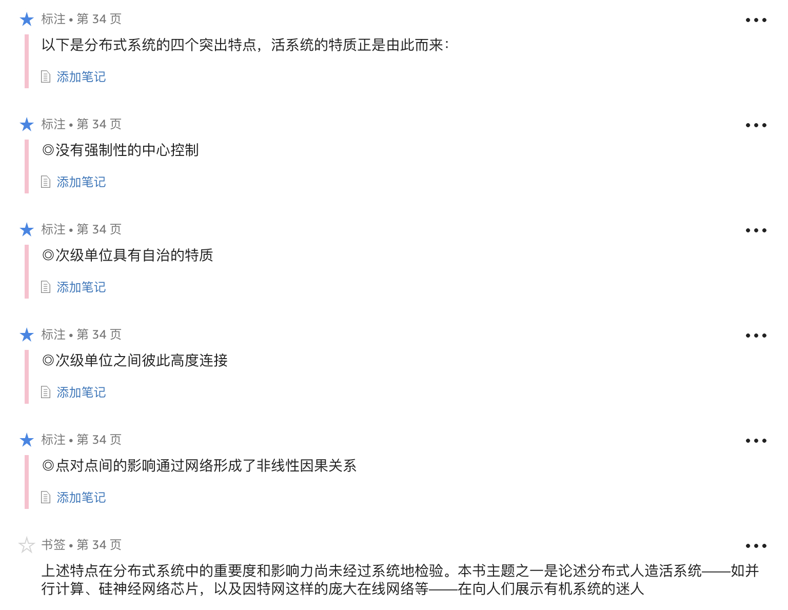
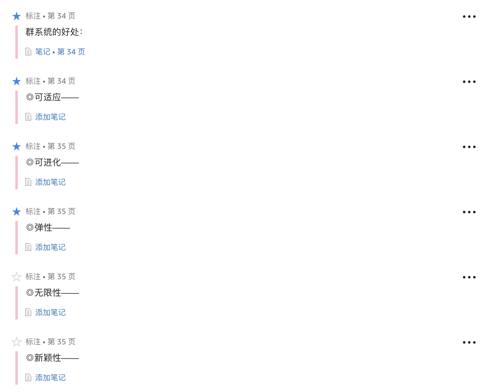
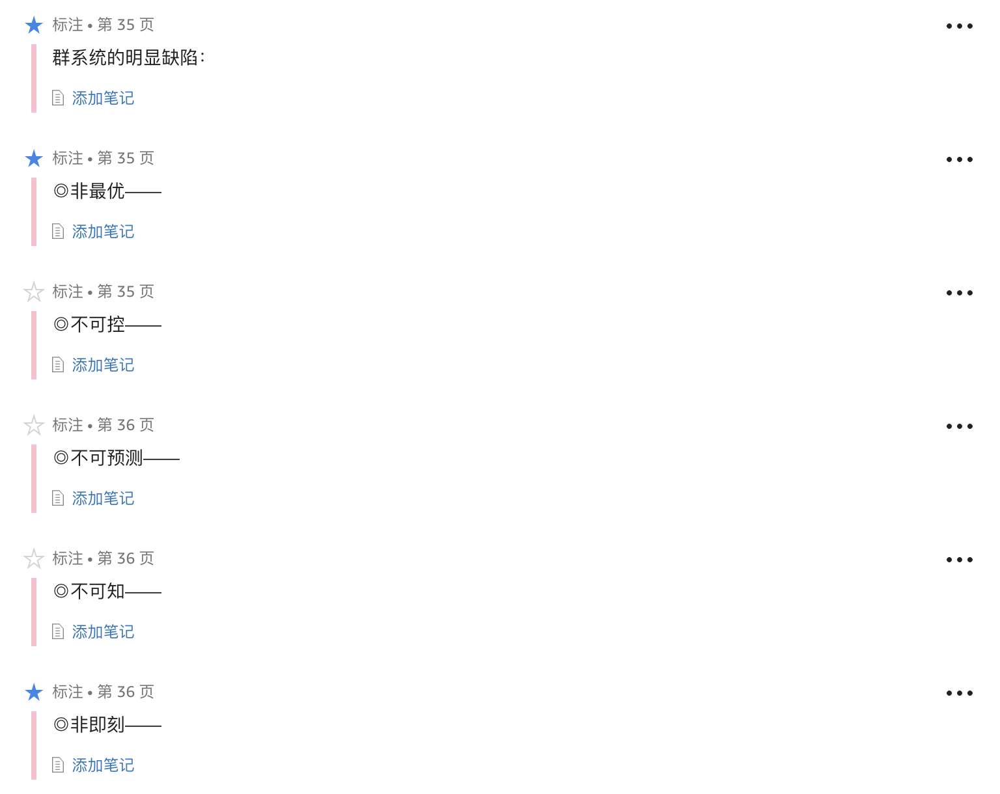
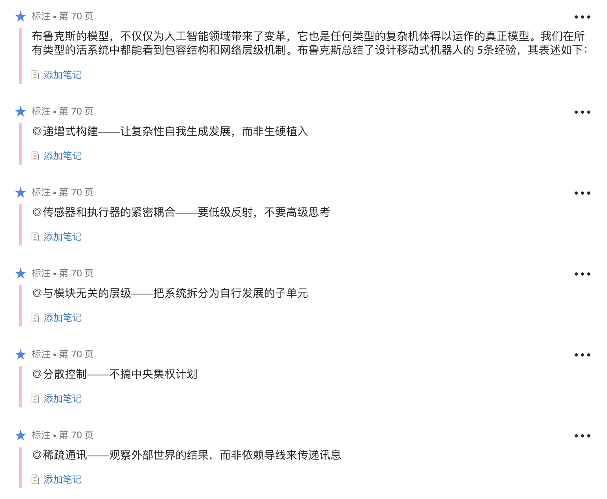
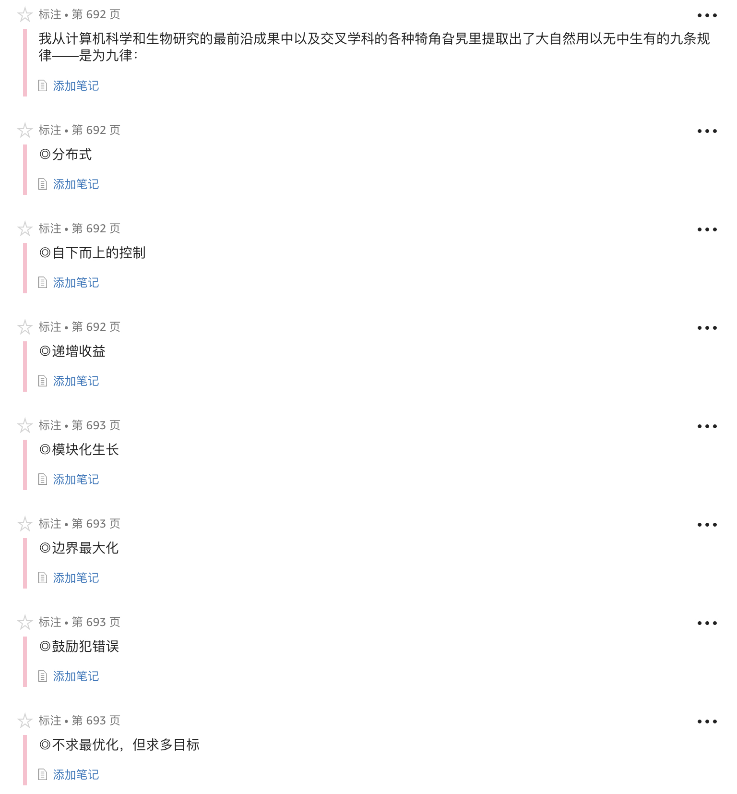
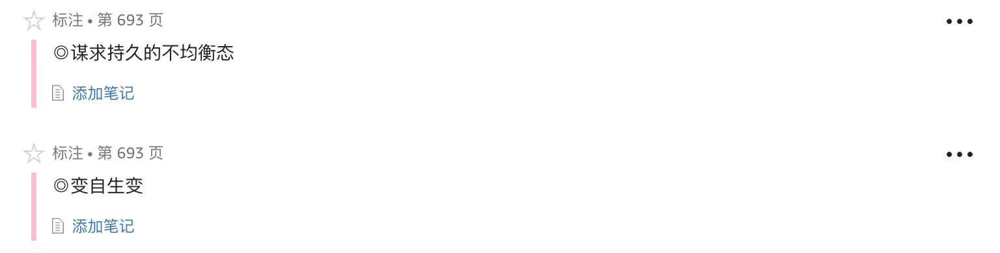

1. 归根结底，数字科技和媒体最终都是为通讯服务。通讯已经不再仅仅是经济的一小部分。通讯就是经济。
1. 新经济是关于通讯的经济，更加深刻，更加广泛。本书提到的所有变革都来源于我们正在进行的通讯变革的方式。通讯是社会、文化、人性、自我认知以及所有经济体系的基础。
1. 如果任何物品都能发送少量的信息并从邻近节点接受信息，我们可以将死物变成活的节点。
1. 单一功能的元件，以合适的方式连接起来，会产生奇妙的效果。大量的单一功能聚合可以形成智慧，这是最可靠的方式。
1. 我们要实现机器间的直接对话，系统中的信息需要更多的横向流动、向外流动、相互流动，而不是都流向系统中心。**而我们要问的是：我们的产品和服务对我们的业务了解多少？有多少当前的知识传到了边缘？既然外沿才是行动的中心，那么我们对外界沟通的工作又做得怎么样？**
1. 一项技术拥有越多的互联性，就能产生越多的使用和滥用。
1. 随着商品和服务越来越丰富，它们也变得越有价值，随着它们越有价值，它们变得更加便宜，那么这个逻辑的自然延伸就是，最有价值的东西应该是那些普遍存在的而又免费的东西。
1. 在富足的世界里，唯一稀有的资源是人类的注意力。
1. 推出"不完善"的半成品并不是降低成本的绝望表现；当客户比你聪明时，这是完善产品的最明智举动。
1. **次级市场才是市场。**
1. 如果了货币和信息从某样东西上流过，它就是网络经济的一部分。
1. 公司在捍卫他们赖以生存的的技术时，显得非常有创造性。经常在这些技术的消亡可以清醒地预见时，它们的设计和性能的精致程度才达到无法想象的高度。
1. 不稳定、不均衡是常态；最优化不会持续太久。
1. 卡住的公司必须回退。为了从所在山的高峰走向另一座更高山的山峰，公司必须先下山。如果那样做，它必须反转自己，一时间会变得不适应、不健康、脱离最优化。相比起现在所在的山峰，它必须接受低效和不完美。
1. **公司的竞争力存在于组合技能之中……像迪斯尼一样的公司几乎不能模仿，因为想要一次性获得它高度综合的技能组合很困难……自然形成的技能组合也使得回退异常困难。回退意味着同时反抗一个组织所有最好的品质。**
1. 因为技能组合限制（或捍卫）了一个组织，创立一个组织比变革一个已经既成的组织更简单。
1. 渐进主义是创新最大的敌人。
1. **在某种程度上，每个组织都忍受机能紊乱之苦，但是对于黄金时期中的创新组织，沟通不协调、天才之间激烈较量以及可能致命的组织紊乱等现象十分常见。**
1. **为了延续创新，你需要追求持续的失衡。而追求持续的失衡意味着不能被颠覆吓倒，半途而废。**
1. 你仿佛要在灾难面前小步跳跃，以坠落为动力走向辉煌。许多人把这个过程比作冲浪。
1. 如果没有员工抱怨周遭的混乱，你反倒可能遇到问题。当然，我们不希望整个机构总是一派散沙（饶了财务部门吧），**但是核心部门必须保持混乱。一些职位可采取轮岗制。**
1. 在网络经济中，经济规则的核心是增进联系。
1. **如果你不知道投资哪种技术，那就选择能够最广泛、最频繁、最多样化地联通的那项。避免任何孤岛式的技术，不管那个孤岛看上去有多棒。**
1. 机遇优于效率：与其解决问题，不如寻求机遇。
1. 创造更多新机遇，比起优化已有的东西，能够使你收获更多。
1. **当你在解决问题的时候，你是在助长你的失败，压抑你的成功，最后收获的只是代价昂贵的平庸。**
1. 试图测量生产力的一个问题在于，它只能测出人们能把错误的工作做得多棒。任何能够被测量生产力的工作，也许必须得从人们的工作列表上删去。
1. 在未来，把下一件事情做对，比把同一件事情做得更好，要有意义的多。

***

1. 在新科技被淘汰前，你不会有足够的时间来掌握任何事情，所以你会一直保持菜鸟的身份。永远是菜鸟是所有人的新设定，这与你的年龄，与你的经验，都没有关系。
1. 没有不适的世界会停滞不前；某些方面过于公平的世界，也会在其他方面上不公平得可怕。乌托邦中没有问题可烦恼，但乌托邦也因此没有机遇存在。
1. **今天的问题来自昨天的成功。而对今天问题的技术解决方案，又会给明天埋下隐患。随着时间流逝，真正的利益便在这种问题与解决方案同时进行的循环扩张背后逐渐积累起来。**
1. **要么实时发生，要么不存在。**
1. **速度为王，质量靠边站。**
1. 当复制品大量存在时，它们就会变得没有价值，无法复制的东西反而会变得罕见而有价值。当复制品免费时，你就要去销售那些无法复制的东西。

1. 在1950年时，一个啤酒罐是由镀锡钢做成，重量可达73克。在1970年时，更轻、更薄也较为灵巧塑形的铝制罐子将其重量降至16克。采用更为精巧的折叠和弯曲工艺使得原材料的使用大大减少，以至于现在的啤酒罐重量只有13.5克，或者说只有当初重量的五分之一。
1. 在信息丰富的世界里，唯一稀缺的资源就是人类的注意力。
1. 当所有商品的费用都在向零靠近时，唯一一件还在增加费用支出的事情就是人类的体验。
1. 纽约大学经济学家保罗·罗默（Paul Romer）专门研究经济增长理论，他认为**真正可持续的经济增长并非源于新资源的发现和利用，而是源于将已有的资源重新安排后使其产生更大的价值。**
1. 斯坦福大学人工智能实验室的负责人李飞飞就坦言：“我认为图像和视频里的像素数据就是互联网宇宙中的暗物质。我们现在正开始让它的特性显现出来。”
1. 重混——对已有事物的重新排列和再利用，对传统的财产观念和所有权概念产生了巨大的破坏。
1. 全球经济都在远离物质世界，向非实体的比特世界靠拢。同时，它也在远离所有权，向使用权靠拢；也在远离复制价值，向网络价值靠拢；同时奔向一个必定会到来的世界，那里持续不断发生着日益增多的重混。
1. **正如经济学家罗默和亚瑟提醒我们的，重组才是创新和财富的唯一动力源泉。**
1. 对于任意一条知识，你很容易就能得到一个反对观点。任何一个事实都有它的反事实。
1. 这就是知识之屏的诅咒：你不能依赖专家解决问题，因为每个专家都有一个与其相对的反专家。

***

1. 到目前为止，那些原属于生命体却成功被移植到机械系统中的特质有：自我复制、自我管理、有限的自我修复、适度进化以及局部学习。我们有理由相信，还会有更多的特质被人工合成出来，并转化成新的东西。
1. 创造出什么样的记忆，有赖于最近我往记忆里塞入了什么，也包括上次重组这段记忆时所加进去的感觉或其他事情。这就是为什么每次回忆起来都有些微不同的原因，因为每次它都是真正意义上的完全不同的经历。感知的行为和记忆的行为是相同的。两者都是将许多分布的碎片组合成一个自然涌现出的整体。
1. 认知科学家道格拉斯·霍夫施塔特 [16] 说道："记忆，是高度重建的。在记忆中进行搜取，需要从数目庞大的事件中挑选出什么是重要的，什么是不重要的，强调重要的东西，忽略不重要的东西。"这种选择的过程实际上就是感知。"我非常非常相信，"霍夫施塔特告诉我，"认知的核心过程与感知的关系非常非常紧密。"
1. 在一个稀疏分布式网络中，记忆是感知的一种。回忆行为和感知行为都是在一个非常巨大的模式可选集中探查所需要的一种模式。我们在回忆的时候，实际上是重现了原来的感知行为，也就是说，我们按照原来感知这种模式的过程，重新定位了该模式。

1. **在需要终极适应性的地方，你所需要的是失控的群件。**
1. 通用的分布式控制的第二个重要方面在于控制的分类聚合必须从底部开始渐进累加。把复杂问题通过推理拆解成符合逻辑的、互相作用的因子是不可能的。
1. 相关的定律可以简明地表述为：必须从简单的局部控制中衍生出分布式控制；必须从已有且运作良好的简单系统上衍生出复杂系统。

1. **工程师们发现的这个控制论原理是个一般性的原理：如果所有的变量都是紧密相关的，而且如果你真正能够最大限度地控制其中的一个变量，那么你就可以间接地控制其他所有变量。**

***