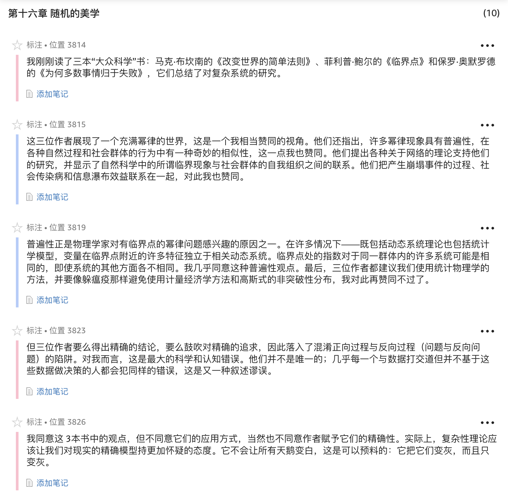

1. 所以我不同意亚当·斯密等经济学家的观点：自由市场之所以能够运转，是因为它允许人们走好运，不论他们是拼命努力还是犯错，而不是对技能予以奖励或"激励"。**所以，正确的策略应该是尽可能多地尝试和尽可能多地把握黑天鹅机会。**
1. 除了过度专注于已知知识以外，人性还有另一个弱点：习惯于学习精确的东西，而不是从总体上把握。
1. 有两种认识现象的方式。第一种排除不正常的现象，只关注正常现象。研究者不理会意外事件，只研究正常案例。第二种则认为，为了理解一种现象，人们需要首先考虑极端现象，尤其是当它们有非同寻常的效应积累的时候，比如黑天鹅现象。
1. 我对于正常现象不太关注……实际上，正常的东西经常是不重要的。
1. 许多事物都被贴上了"未知"、"不可能"、"不确定"的标签，而在我看来却并非如此。它不是具体和精确的知识，或一个被"愚人化"了的领域，正相反，它表明知识的缺乏（和局限）。它是知识的反面。**要想描述知识的反面，你应该学会避免使用为知识所造的词语。**
1. 注意，在本书中，我不依赖于选择性地收集"证实性证据"的野蛮方法。鉴于我将在第五章阐述的原因，我称这种过度举例为无知的经验主义，因为**为了编造一个故事而不断罗列的逸事并不构成证据。**
1. 对待历史问题，人类的思想会犯三个毛病，我称之为三重迷雾。它们是： 1. 假想的理解，也就是在一个超出人们想象之外的复杂（或随机）的世界，人们都以为自己知道其中正在发生着什么。 2. 反省的偏差，也就是我们只能在事后评价事物，就像只能从后视镜里看东西（历史在历史书中比在经验现实中显得更加清晰和有条理）。 3. 对事实性信息价值的高估以及权威和饱学之士本身的缺陷，尤其是在他们进行分门别类的时候，也就是进行"柏拉图化"的时候。
1. 实际上，编辑的过程会出现严重的扭曲，尤其当一名作者被安排给一名所谓的"好编辑"的时候。
1. 分类总会造成复杂性的降低，这是黑天鹅事件的发生器，也就是我在序言中定义的柏拉图化的表现。我们对周围世界的任何简化都可能产生爆炸性后果，因为它不考虑不确定性的来源，它使我们错误地理解世界的构成。
1. 并且平均每3年休息一年，弥补自己在科学和哲学方面落下的空白。为了慢慢提炼我的思想，我需要成为一个闲人，一个职业冥想者，懒洋洋地坐在咖啡馆，远离办公桌和各种组织，睡到自然醒，贪婪地阅读，而不需对任何人解释什么。
1. 皮埃尔–丹尼尔·休特（Pierre-Daniel Huet）1690年撰写了《人类思维缺陷的哲学论述》（Philosophical Treatise on the Weaknesses of the Human Mind）一书，这是一本对教条进行猛烈抨击、对人类思维提出质疑的了不起的书。休特提出了反对因果关系论的有力论据，比如他指出，任何事件都可能有无数种可能的原因……休特一直活到90多岁，一名仆人跟着他，在他吃饭和休息时为他大声读书，以免浪费时间。
1. 我们喜欢故事，喜欢总结，喜欢简化。
1. 我们习惯于过度解释，偏好简洁的故事，而不是原始真相。
1. 叙述谬误指的是我们无法在不编造理由或者强加一种逻辑关系的情况下观察一系列事实。对事实的解释会与事实混在一起，使事实变得更容易被记住，更符合道理。这种倾向的坏处在于它使我们以为对事物有了更好的理解。
1. 作为灵长类中的人类，我们十分渴求规律，因为我们需要把事物简化，好让它们进入我们的头脑，或者说我们可以将它们挤进自己的头脑。
1. 信息越具有随机性，事物就越复杂，因而越难以概括。你越概括，让事物越有条理，随机性就越低。因此，正是我们的简化行为使我们以为世界的随机性比实际上小。
1. 我们会更容易记住那些符合某种叙述的过去事实，而忽略那些看上去在该叙述中不扮演因果关系角色的部分……因此，不去记住事件的真正顺序，却对事件顺序重新整合，这便使历史事后看上去比实际上更可解释。
1. **记忆更多是一台自动进行动态更新的机器：你记住的是你最后一次回忆的事件，并且在毫无意识的情况下，每次重新回忆就会改写一次故事。**
1. 过度寻找原因的问题不在于记者，而在于大众。没有人会花1美元购买某个无聊的大学讲座的抽象统计学讲义。我们喜欢听故事，而这并没有什么错，只不过我们应该更彻底地审视故事是否严重扭曲了事实。
1. 专家就是一群习惯"筛选"的思维狭隘的人。在筛选不导致错误的情况下，因为黑天鹅事件的影响很小，专家会表现不错。
2. 这个建议并不难，除非你是奴隶，我想你对职业选择多少是有些控制力的。否则这就会成为一个道德问题，而且是严重的道德问题。对于那些仅仅因为"这是我的工作"而进行预测，并且非常清楚自己的预测根本无效的人，我难以称其为有道德的人。
1. 波普尔的观点涉及人们预测历史事件的局限性，以及把历史和社会科学这样的"软"学科降到比美学和娱乐（比如收集蝴蝶和硬币）只高一点的必要性。
1. 哈耶克认为，真正的预测是由一个系统有机地完成的，而不是通过指令完成的。一个单独的机构，比如核心计划者，不可能集合全部知识，许多重要信息会被漏掉。但社会作为一个整体，能够把这些信息都包含在运行中，能够在框架以外思维。随着科学知识的增加，我们高估了自己理解构成世界的微妙变化以及对每种变化赋予重要性的能力。他把这贴切地称为"科学主义"。
1. 他指出，物理学方法不适用于社会科学，并批评了这种做法中的工程学思维。
1. 最优化是指为一个经济问题找到数学上的最优解决方案。例如，你对不同股票的"最优"购买数量是多少？它涉及复杂的数学，因此对非数学学者设立了进入障碍。我不是第一个提出这种最优化阻碍了社会科学的人，它把社会科学从一个思考和沉思的学科降低为一种"精确的科学"。"精确的科学"指的是那些假装热爱物理学或患有物理嫉妒病的人从事的二流工程问题。换句话说，它是智力骗局。
1. 可叹的是，实际上是萨缪尔森和他的大部分追随者不懂数学，或者说不懂如何运用他们所知道的数学，不懂怎样将之用于现实。他们知道的数学只够蒙蔽他们的眼睛。
1. 我们天生不会尊敬谦卑的人。
1. 可惜，人们不可能通过承认自己会犯错来显示权威。很简单，人们需要被知识蒙蔽。
1. 绑在一起走向错误的方向比独自走向正确的方向更有利。那些追随武断的白痴而不是内省的智者的人把他们的一些基因传给了我们。这在一种社会病态中表现明显：精神变态者能够吸引追随者。
1. 我们的问题不仅在于我们不知道未来，还在于我们不知道过去。
1. 正向过程通常存在于物理学和工程学中，反向过程通常存在于不可重复、不可实验的历史过程中。
1. 历史学家应该远离混沌理论以及求方程式的难题，而只去讨论世界的一般特点，并了解他们不可能知道什么。
1. 历史能使我们陶醉地以为了解了过去，满足了我们讲故事的愿望（确实），只不过是非常有害的故事。人们应该极为谨慎地学习。如果没有谨慎的态度，历史显然不是一个理论化和得出一般知识的地方，也不会对未来有所帮助。我们能从历史中得到负面认知，这一点是无价的，但同时我们也得到了太多知识的假象。
1. **学会阅读历史，吸取所有可能的知识，不要对奇闻逸事皱眉，也不要建立任何因果链条，不要试图过多地求方程，但如果你这样做了，也不要大张旗鼓地提出科学观点。**
1. 面对历史，越想超越叙述，从而做到最低程度的理论化，我们的麻烦就越大。
1. **我们也许需要花一代人的时间让怀疑经验主义历史学家懂得正向过程与反向过程的区别。**
1. 对确定性的追求是人类的本性，也是一种思维的恶习。
1. 在《盲眼钟表匠》中，理查德·道金斯极具智慧地提出，世界不存在伟大的设计者，而是通过小的随机变化前进的。不过，我有一点小小的异议，但不妨碍整体论点：世界是通过大的随机变化前进的。
1. **不要寻找精确和局部的东西。**
1. 如果你听到某个"杰出"经济学家说到均衡或正态分布，不要与他争论，只要忽视他，或试着将一只老鼠放进他的衬衣。
1. 作为对这个内容繁多的关于预测部分的总结，我要说，我们很容易概括出为什么我们无法理解正在发生什么。那就是：1. 认知自大以及随之而来的未来盲目性；2. 柏拉图式的分类概念，或者说人们如何被简化愚弄，尤其当他们在一个不存在专家的学科里获得了学位时；3. 错误的推理方法，尤其是不考虑黑天鹅现象的平均斯坦方法。
1. **人类不是复印机。所以具有传染性的思想一定是那些我们准备要相信的，甚至是天生要相信的。一种思想要获得传播，就必须与我们的本性相符。**
1. 只是知道我们处于一个幂律环境并不能让我们获得很多信息。为什么？因为我们必须计算现实生活中的参数，这比在高斯框架下困难得多。只有高斯分布能够很快显现出特性。我的建议就是只把它当做看待世界的一般方法，而不是精确的解决办法。
1. 传统的高斯方法只关注平均水平，把意外当做附属问题。我们还有另一种方法，它把意外当做起点，把平均水平当做附属问题。
1. 钟形曲线满足了那些容易上当的人对简化论的需求。
1. 为了看清高斯方法的误用多么普遍以及危害多么大，请看一部由多产作家、大法官理查德·波斯纳（Richard Posner）撰写的（无聊的）书《大灾难》（Catastrophe）。波斯纳哀叹公务员对随机性的误解，建议政府的政策制定者向经济学家学习统计学。法官波斯纳看上去正在努力制造灾难。尽管属于应该多花时间读书而不是写书的人，
1. 凯特勒把钟形曲线应用于一切地方。他被钟形曲线遮住了眼睛，这让我再次看到，一旦你让钟形曲线进入你的头脑，就很难把它赶出来。后来，弗兰克·伊西德罗·埃奇沃思（Frank Ysidro Edgeworth）把这种将钟形曲线用在一切地方的严重错误称为凯特勒错误。
1. 彭加莱写道，他的一位"杰出的物理学家"朋友向他抱怨，物理学家喜欢使用钟形曲线，因为他们以为数学家认为它是必备的数学工具；而数学家使用钟形曲线，是因为他们以为物理学家认为它是经验事实。
1. 一个数字就能瓦解你的所有平均值，一次亏损就能抹平一个世纪的利润。
1. 我对这一点有一个认知上的问题，我不明白为什么我们要为世界不能满足某个理想模型找理由，而这个模型只不过是得到了对现实视而不见的人的追捧。
1. 科学的桂冠只会授予那些把点连成线的人，而不是进行随意观察的人，即使被无知的科学家称为"发明"了适者生存法则的达尔文也不是提出这一理论的第一人。
1. 我刚刚读了三本"大众科学"书：马克·布坎南的《改变世界的简单法则》、菲利普·鲍尔的《临界点》和保罗·奥默罗德的《为何多数事情归于失败》，它们总结了对复杂系统的研究。这三位作者展现了一个充满幂律的世界，这是一个我相当赞同的视角。他们还指出，许多幂律现象具有普遍性，在各种自然过程和社会群体的行为中有一种奇妙的相似性，这一点我也赞同。他们提出各种关于网络的理论支持他们的研究，并显示了自然科学中的所谓临界现象与社会群体的自我组织之间的联系。他们把产生崩塌事件的过程、社会传染病和信息瀑布效益联系在一起，对此我也赞同。
1. 我刚刚读了三本"大众科学"书：马克·布坎南的《改变世界的简单法则》、菲利普·鲍尔的《临界点》和保罗·奥默罗德的《为何多数事情归于失败》，它们总结了对复杂系统的研究。这三位作者展现了一个充满幂律的世界，这是一个我相当赞同的视角。他们还指出，许多幂律现象具有普遍性，在各种自然过程和社会群体的行为中有一种奇妙的相似性，这一点我也赞同。他们提出各种关于网络的理论支持他们的研究，并显示了自然科学中的所谓临界现象与社会群体的自我组织之间的联系。他们把产生崩塌事件的过程、社会传染病和信息瀑布效益联系在一起，对此我也赞同。普遍性正是物理学家对有临界点的幂律问题感兴趣的原因之一。在许多情况下----既包括动态系统理论也包括统计学模型，变量在临界点附近的许多特征独立于相关动态系统。临界点处的指数对于同一群体内的许多系统可能是相同的，即使系统的其他方面各不相同。我几乎同意这种普遍性观点。最后，三位作者都建议我们使用统计物理学的方法，并要像躲瘟疫那样避免使用计量经济学方法和高斯式的非突破性分布，我对此再赞同不过了。
1. **在缺乏反馈过程的情况下，你会认为模型证实了现实。**
1. 在过去50年中，金融市场最极端的10天代表了一半的收益。
1. 我要反复说下面的话，直到声音嘶哑：社会科学理论的命运取决于其传染性，而不是其正确性。
1. 默顿写道，在投资组合理论之前，金融学只是"奇闻逸事、拇指规则和对会计数据的操纵"。投资组合理论"把这种知识大杂烩变成严谨的经济学理论"。
1. 只要保持镇定和微笑，专心致志地分析那个说话者而不是他说的话，你就会赢得这次争论。
1. 我宁愿在大的范围内做得正确，而不愿在精确的地方犯错误。
1. 希望我已经足够透彻地表达了我作为一名实践者的观点，那就是你不能从书本到问题，而是应该相反，从问题到书本。
1. 在这种方法面前，那些以赚取学术资历为目的的人说的大部分空话都会失效。如丹尼尔·丹尼特的玩笑所说，学者不应该是一座图书馆用来建造另一座图书馆的工具。
1. 哲学学派的衰落是由于人们错误地以为可以在不受哲学以外的问题的迫使下研究哲学……真正的哲学问题的根总是在哲学以外，如果这些根腐烂了，它们也会死亡……哲学家会轻易忘掉这些根，他们"研究"哲学，而不是被非哲学问题强迫思考哲学。
1. **谨防人造的稳定性**