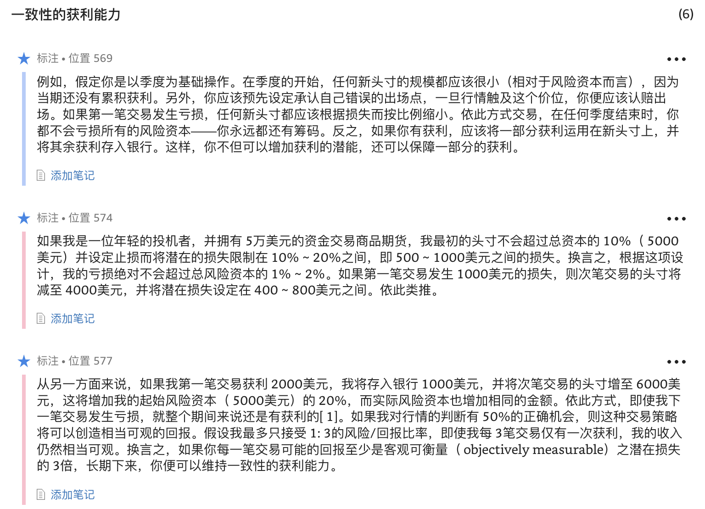
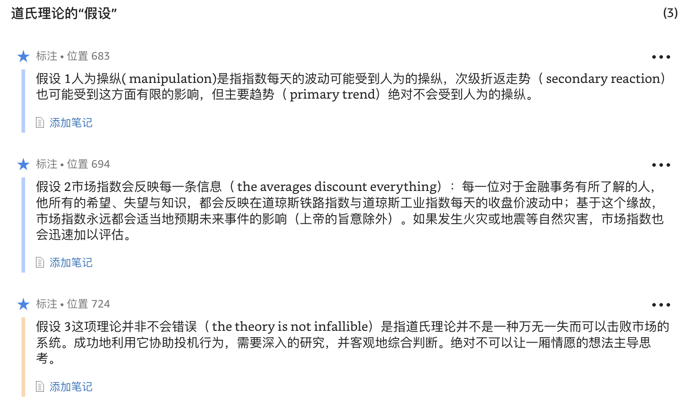

1. 唯有在可以持续的情况下，荣耀才是美好的。
1. 如果我在交易生涯中学到了什么，那便是：知识本身绝对不是成功的保证。除了知识，你还需要一套执行知识的管理计划以及严格遵守计划的心理素质，这样才可以免除情绪的干扰。
1. 重点未必在于你知道多少，而在于你知道内容的真实性与相关性。
1. 在任何领域内，明智的决策都需要依赖基本知识（essential knowledge），使所有事件都可以诉诸于这个统辖因果关系的根本概念中。
1. 掌握这种知识，需要持续将明确的事件转化为抽象的概念，并将抽象的原则套用在实际的事件上；根据对现在事件的分析，预测长期的未来；以适用近期与过去历史的同一个概念，了解现在发生的事件。我称这种程序为"根据重点思考"，或"根据原则思考"。
1. 就风险/回报的角度思考，最大的可接受比率为1:3。
1. 任何人进入金融市场，如果他预期将有一半以上的交易会获利，该预期会被很突然地醒悟。
1. **最佳选手的打击率也只不过是30%至40%。然而，优秀选手都知道，安打的效益总是大于三振的伤害。**
1. 任何既有的获利都不可再损失50%。
1. 任何分析方法若认为市场不会犯错，那显然就是最根本的错误。
1. 务必记住，市场的存在是为了促进交易，交易之所以会产生，是因为参与者对价值的偏好与判断不同。
1. 市场指数具有预测能力，是因为它在统计上代表一种市场的共识，这种共识以钞票表达。
1. 差别并不在于智慧与知识，而是在于执行知识的意志力。
1. 有一句俗语说，“你无法改变他人的见解，他们必须自己改变。”一般来说，唯有整个世界都在他们面前崩解，唯有他们已经毫无退路而只有向前时，人们才会考虑改变。
1. 犹如休谟与穆勒一样，凯恩斯的经济理论也是处于一种静态的架构内，其中的因果关系都会自动地发生在“总体层面”上。根据我个人的看法，这是一个严重的错误。
